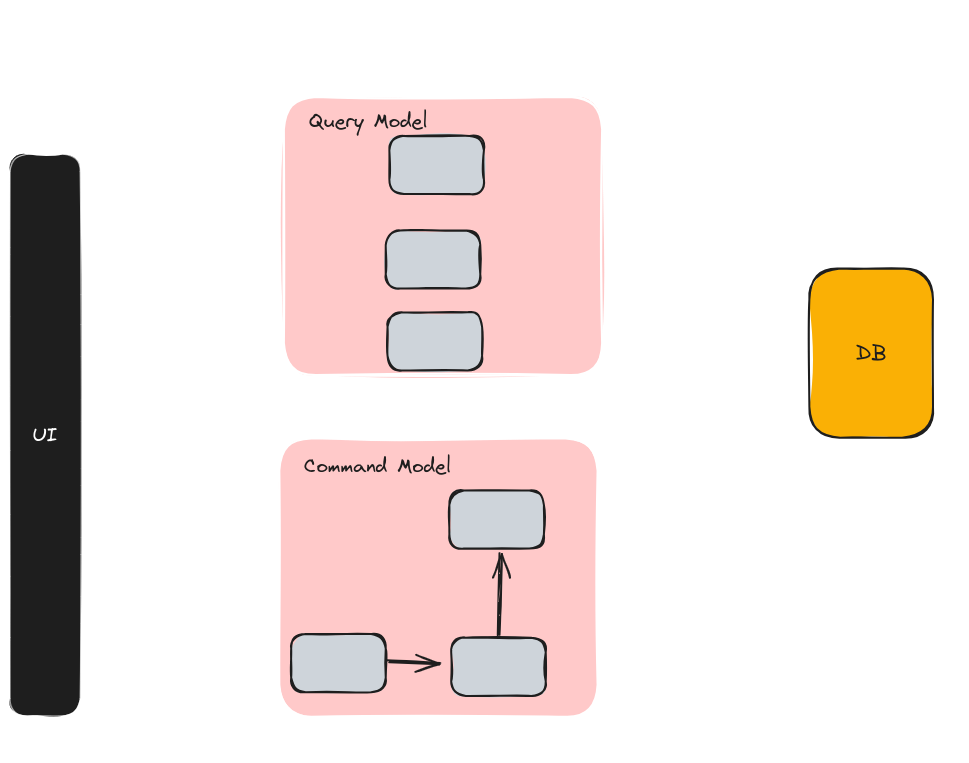
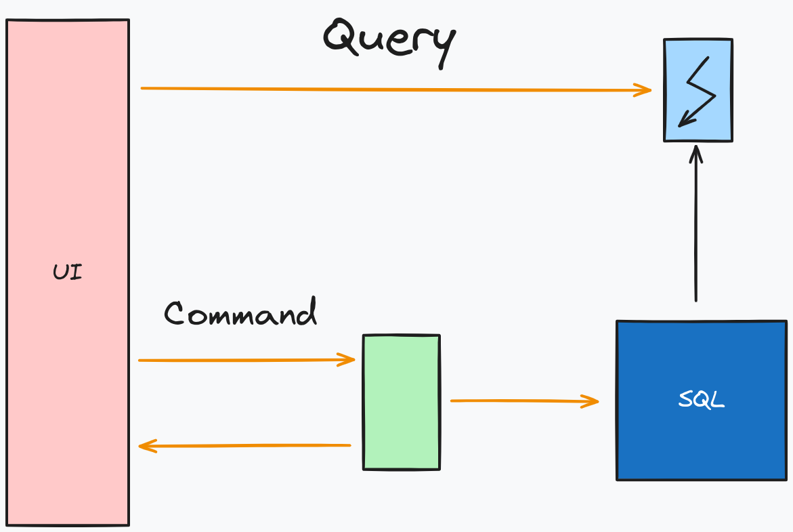

# CQRS - Segregação de Responsabilidade entre Comando e Consulta

## Introdução
CQRS (Command Query Responsibility Segregation) é um padrão arquitetural que separa as operações de leitura (consultas) das operações de escrita (comandos) em um sistema.

## Padrão Arquitetural

- **Cliente**: Interage com a API para enviar comandos e fazer consultas.
- **Escrita**: Comandos são enviados para o domínio.
- **Leitura**: Consultas são direcionadas diretamente para o banco de dados.
- **Bancos de Dados**: Sugere-se a utilização de um banco relacional para escrita e um banco não relacional para leitura.
- **Sincronização**: O envio de dados do banco relacional para o banco não relacional é feito por meio de eventos.

# Cenários

## Cenário Clássico

O cenário clássico utiliza um banco de dados para leitura e gravação, compartilhando o mesmo modelo de dados para consultas e atualizações. Essa abordagem é simples e funcional, adequada para funções CRUD básicas. No entanto, para projetos mais complexos, ela pode apresentar desvantagens, como mapeamento complicado de objetos devido a consultas diferentes no lado da leitura e implementação complexa de validação no lado da escrita.

## Cenário CQRS 

## Modelagem

O CQRS separa leituras e gravações em modelos distintos, utilizando comandos para atualizações e consultas para leituras. Os comandos são baseados em tarefas, podendo ser processados de forma assíncrona. A segregação física dos dados de leitura e gravação é possível, permitindo que o banco de dados de leitura tenha seu próprio esquema otimizado.

## Benefícios

- **Escala Independente:** Permite escalonar cargas de trabalho de leitura e gravação independentemente.
- **Esquemas Otimizados:** Banco de dados de leitura pode ter esquema otimizado para consultas, enquanto o de gravação usa um sistema otimizado para atualizações.
- **Segurança:** Facilita garantir que as entidades corretas executem gravações.
- **Separação de Responsabilidades:** A segregação entre leitura e gravação resulta em modelos mais fáceis de manter.
- **Consultas Simples:** Armazenando visualizações materializadas no banco de dados de leitura, evita junções complexas durante a consulta.

## Desafios de Implementação

- **Complexidade:** CQRS, especialmente com event-sourcing, pode levar a modelos mais complexos.
- **Mensagens:** Embora não seja obrigatório, mensagens são frequentemente usadas para processar comandos.
- **Consistência Eventual:** Separar banco de dados de leitura e gravação pode resultar em dados desatualizados no banco de leitura.

## CQRS - Quando Não Usar

- **Dominio ou Regras Simples:** Quando o domínio ou regras de negócios são simples.
- **Interface de Usuário Simples:** Para interfaces de usuário simples no estilo CRUD.
- **Operações de Acesso a Dados Suficientes:** Quando operações básicas de acesso a dados são suficientes.

> [!NOTE]
> A utilização do CQRS é indicada para cenários com alta demanda de consumo de dados e operações intensivas de leitura e escrita.

# Padrão Mediator

O Mediator é um padrão comportamental que promove o acoplamento fraco entre objetos, encapsulando a interação e eliminando a necessidade de comunicação direta, reduzindo a complexidade do sistema.

## MediatR

O MediatR é uma biblioteca para o padrão Mediator, frequentemente utilizada em conjunto com o CQRS.

O Mediator ajuda a implementar a comunicação entre comandos, manipuladores de comandos, consultas e manipuladores de consultas quando aplicado ao CQRS.

## CQRS e MediatR

## Modelos de implementação

Implementacão dos comandos e os respectivos manipuladores, os handlers, realizando as operações que alteram o estado da entidade e persiste as informacões no banco de dados.

Seguindo a mesma logica da criação dos commands, juntando a consulta com o manipulador em uma unica classe de consulta.

Modelo de Exemplo com dois bancos de dados, um relacional para escrita e outro não relacional para a leitura.

# Validacão e Pipeline do Request

O processo de validação e o pipeline de request são fundamentais para garantir a integridade e a consistência das operações em uma aplicação ASP.NET Core.

## Funcionamento do Pipeline:

- O pipeline é responsável por receber as requisições HTTP, processá-las e gerar as respostas correspondentes.
- É composto por componentes chamados middleware, cada um responsável por processar o request de alguma forma.
- As operações incluem autenticação, roteamento, tratamento de erros, entre outros.
- Os middlewares são executados em ordem e cada um pode modificar o request ou a response antes de passar para o próximo middleware.

## Abordagem Tradicional vs Abordagem com Behavior do MediatR:

- Na abordagem tradicional, a lógica de validação é realizada no próprio comando após sua chegada na aplicação.
- Na abordagem utilizando o behavior do MediatR, a lógica de validação é inserida dentro do pipeline, garantindo que a validação ocorra antes do comando chegar à aplicação.

# CQRS e Notificações de Eventos

## INotification

A interface `INotification`, fornecida pela biblioteca MediatR, representa uma notificação ou mensagem a ser transmitida através do mediador (mediator) e pode conter informações relevantes sobre um evento que ocorreu no sistema.

- Encapsula informações sobre eventos ocorridos ou que precisam ser comunicados.
- Permite que diferentes partes do sistema enviem e recebam notificações de eventos sem se acoplarem diretamente.
- Permite que partes do sistema se comuniquem de forma assíncrona sem acoplar diretamente os componentes.
- É útil para comunicar eventos, erros ou outros estados que outras partes do sistema podem querer reagir.

---------------------

**Fontes de Estudo**
- [ASP.NET Core - CQRS com MediatR](https://youtube.com/playlist?list=PLJ4k1IC8GhW0lLT4Hs2rD8veMJyLGbrJ3&feature=shared)
- [CQRS e .NET | Construindo uma aplicação completa em camadas](https://youtu.be/hlum-rdeWoM?feature=shared)

## Autores

Estes projetos de exemplo foram criados para fins educacionais. [Marcelo](https://github.com/Mmarcelinho) é responsável pela criação e manutenção destes projetos.

## Licença

Este projetos não possuem uma licença específica e são fornecidos apenas para fins de aprendizado e demonstração.
